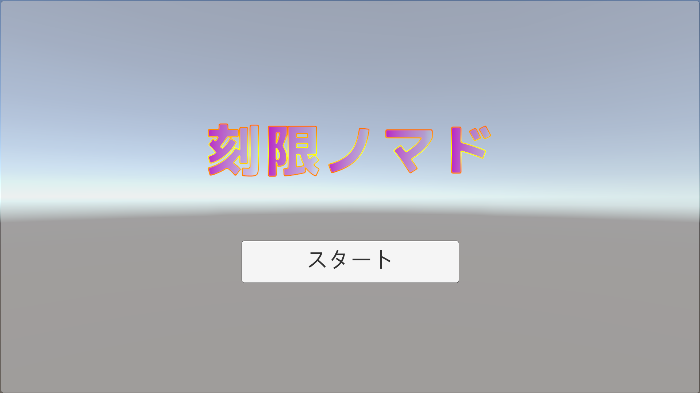
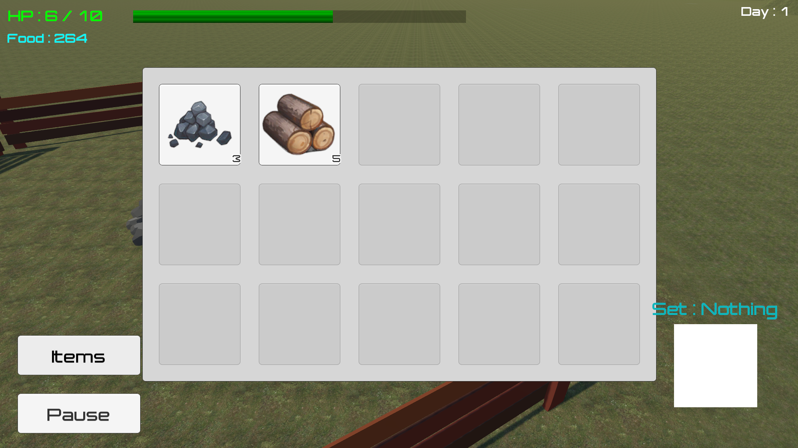
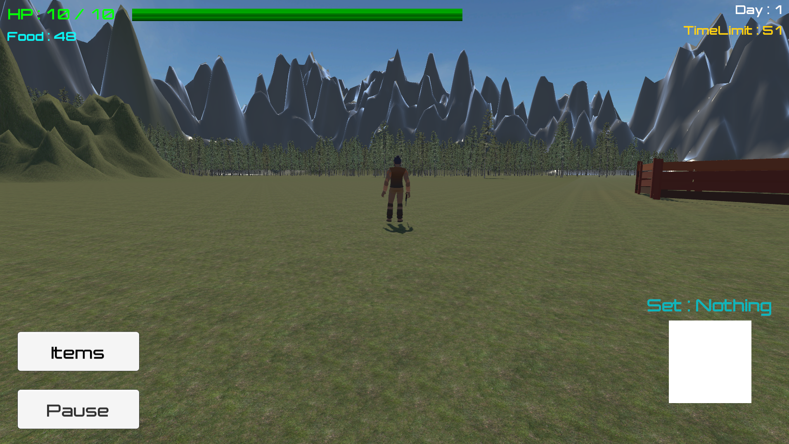
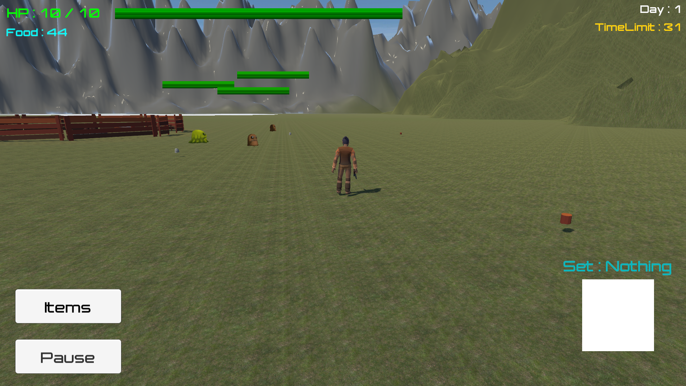

# 刻限ノマド

## プレイ動画

https://youtu.be/C_fo3HEGH5M

## スクリーンショット

### タイトル画面

### アイテム画面

### フィールド

## 実行方法

以下のリンクからzipファイルをダウンロードしてください。

https://drive.google.com/file/d/1RSThjmhSImGd2VZdiSPyQ7UmB_tb0wT4/view?usp=drive_link

## 使用技術

* Unity
* C#
* Visual Studio

## 制作形態

個人制作

## ゲーム概要

限られた時間内で食糧や物資を集め、拠点に持ち帰って生き残りを目指す3Dサバイバルアクションゲームです。

ゲーム内では1日につき60秒しか拠点外で活動することができません。プレイヤーは限られた時間の中で食糧や素材を集め、拠点へ持ち帰ることで生存日数を伸ばしていきます。

探索と帰還を繰り返しながら装備や能力を強化し、より危険なエリアへ挑戦していくことを目的としています。

## 操作方法

【キーボード・マウス】

* W,A,S,Dキー / 矢印キー：移動
* 左クリック：攻撃
* 右クリック＋ドラッグ：視点移動

## 工夫した点

本作品では、60秒という限られた時間で探索と帰還を繰り返すゲームサイクルを軸として設計しています。

探索を重ねるごとに行動範囲や選択肢が広がり、プレイヤーが成長を実感できるよう以下の要素を実装しました。

* アイテムクラフト機能により、収集した素材からより強力なアイテムを作成できる
* クラフトしたアイテムによって探索効率や行動範囲を拡張できる
* 日数経過に応じて強力な敵が出現し、プレイヤーにも継続的な強化が求められる

また、探索・戦闘・素材収集・クラフトが相互に関係するよう設計し、プレイヤーが次の探索に向けて準備する楽しさを感じられるゲームを目指しました。

## 実装した主な機能

* プレイヤー移動・カメラ操作
* 敵キャラクターとの戦闘
* アイテム収集システム
* アイテムクラフトシステム
* 拠点への帰還システム
* 日数管理システム
* 制限時間システム
* 敵キャラクター出現管理
* BGM管理

## 今後実装予定の機能

* 地形ごとに出現する敵キャラクターやアイテムの変更
* ゲームルールやクラフト方法を説明するチュートリアル
* リザルト画面での収集アイテム数・撃破数表示
* セーブ／ロード機能

## ソースコード

Scriptsフォルダに主要なC#スクリプトを掲載しています。
